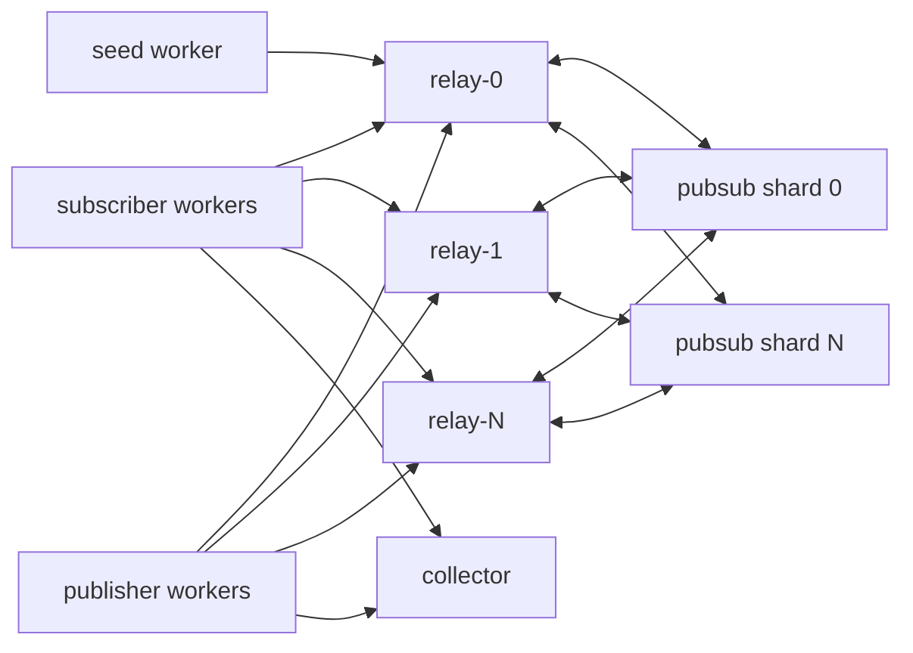

# CGP Loadnet

CGP Loadnet is a small Warnet-style harness for realistic relay testing. It starts multiple relay nodes, one or more websocket pubsub hubs, subscriber workers, publisher workers, and an optional Linux `tc netem` latency/loss profile inside Docker.

The purpose is to measure distributed behavior that the in-process `load:relay` benchmark cannot show:

- cross-relay pubsub fanout
- p50/p95/p99 publish acknowledgement latency
- subscriber delivery under network latency and packet loss
- channel partitioning behavior
- socket churn and reconnect pressure
- reconnect recovery through `GET_HISTORY afterSeq` backfill
- relay restart recovery, retained pubsub log replay, and client multi-relay failover
- pubsub hub restart recovery through disk-retained log envelopes and publish ACK/retry
- slow-consumer/backpressure behavior

## Generate A Compose Network

```powershell
npm run loadnet:run -- --profile smoke
npm run loadnet:run -- --profile smoke-binary-v1
npm run loadnet:run -- --profile smoke-sharded-binary-v1
npm run loadnet:run -- --profile smoke-sharded-binary-v2
```

Or run the steps manually:

```powershell
npm run loadnet:compose -- --profile smoke
docker build --pull=false -t cgp-loadnet:local -f loadnet/Dockerfile .
docker compose -f loadnet/docker-compose.generated.yml up -d
$collector = docker compose -f loadnet/docker-compose.generated.yml ps -q collector
docker wait $collector
docker compose -f loadnet/docker-compose.generated.yml logs collector
npm run loadnet:verify
docker compose -f loadnet/docker-compose.generated.yml down
```

Results are written into `loadnet/results/summary-*.json`.

Compose generation clears `loadnet/run-data` by default so stale readiness or metrics files cannot contaminate a run. Pass `--keep-data` only when intentionally inspecting an old run directory.

## Call Verification Smoke

Hollow call signaling has a focused relay/loadnet smoke that runs in-process with two relay nodes and shared pubsub. It publishes the same `CALL_EVENT` envelope the app emits for DM calls, guild voice rooms, guest invite joins, and reconnect history backfill.

```powershell
npm run loadnet:call-verification
```

## Profiles

Profiles live in `loadnet/profiles`.

```powershell
npm run loadnet:run -- --profile 1k
```

Manual equivalent:

```powershell
npm run loadnet:compose -- --profile 1k
docker build --pull=false -t cgp-loadnet:local -f loadnet/Dockerfile .
docker compose -f loadnet/docker-compose.generated.yml up -d
$collector = docker compose -f loadnet/docker-compose.generated.yml ps -q collector
docker wait $collector
docker compose -f loadnet/docker-compose.generated.yml logs collector
npm run loadnet:verify
docker compose -f loadnet/docker-compose.generated.yml down
```

Only the pubsub shard services declare the shared `cgp-loadnet:local` image build. The relay, seed, publisher, subscriber, and collector services reuse that image to avoid concurrent same-tag Docker builds.

Use `docker build --pull=false ...` when iterating locally so Docker does not block on a registry metadata check for an already cached base image.

## Production Confidence Soaks

Use these profiles for multi-hour, production-confidence validation. They are longer than the baseline `smoke`, `1k`, `churn`, `restart`, `pubsub-restart`, and `slow-consumers` profiles and are intended for release candidates, not default CI.

| Profile | Duration | What it stresses |
| --- | --- | --- |
| `soak-long` | 2h | Sustained subscriber churn on a lossy higher-latency link while publishers complete a meaningful early burst. |
| `soak-chaos` | 3h | The same WAN-like churn plus forced relay restarts, forced pubsub restarts, explicit relay network partitions, and delayed consumers. |
| `smoke-sharded-binary-v1` | 30s | Fast validation for binary-v1 with topic-hashed pubsub shards. |
| `smoke-sharded-binary-v2` | 30s | Fast validation for the compact client publish hot path plus topic-hashed pubsub shards. |
| `restart-pubsub-partition-fast` | 3m | Fast chaos regression profile for local iteration: restart + pubsub restart + partitions + slow consumers. |
| `restart-pubsub-partition` | 25m | Faster failure-recovery profile that combines relay restart, pubsub restart, and timed relay partition windows in one run. |
| `100k-distributed` | 1h | Distributed stress shape for 100k subscribers with churn/restarts/partitions to tune fanout and replay behavior. |
| `1m-distributed` | 2h | Extreme profile template for 1M subscribers; intended for cluster-scale environments only. |

Run one with:

```powershell
npm run loadnet:run -- --profile soak-long
npm run loadnet:run -- --profile soak-chaos
npm run loadnet:run -- --profile restart-pubsub-partition-fast
npm run loadnet:run -- --profile restart-pubsub-partition
npm run loadnet:run -- --profile soak-chaos --compact-after-run
```

Verify the resulting summary with strict delivery and head-consistency gates:

```powershell
npx tsx loadnet/verify-summary.ts --summary loadnet/results/summary-<id>.json --min-delivery-ratio=1.0 --max-publisher-p99-ms=30000 --max-relay-head-lag=0
```

Pass criteria:

- `collectorComplete` is `true`
- `metrics.length` matches `expectedMetrics`
- published messages match the profile
- subscriber delivery ratio is exactly `1.0`
- duplicate replay delivery stays within the configured `--max-duplicate-ratio` gate (chaos defaults to `1.0`, baseline defaults to `0.0`)
- publisher batch `p99` stays within the configured `--max-publisher-p99-ms` gate (defaults: `30000ms` baseline, `60000ms` chaos)
- relay-head `invalidCount`, `errorCount`, and `conflictCount` are all `0`
- relay-head `validCount` is greater than `0`
- every required `netem` target reports `applied: true`

## Network Emulation

Each service gets these profile controls:

- `wireFormat` (`json`, `binary-json`, `binary-v1`, or `binary-v2`; applies to relay/client/pubsub websocket paths)
- `pubSubShards` (number of topic-hashed pubsub hubs; relays subscribe/publish each channel topic to its shard)
- `latencyMs`
- `jitterMs`
- `lossPercent`
- `churnEveryMs`
- `relayRestartEveryMs`
- `relayRestartCount`
- `pubSubRestartEveryMs`
- `pubSubRestartCount`
- `partitionEveryMs`
- `partitionDurationMs`
- `partitionCount`
- `partitionRelaySpan`
- `slowConsumerPercent`
- `slowConsumerDelayMs`

Containers need `NET_ADMIN` so `tc qdisc replace dev eth0 root netem ...` can apply latency/loss. If Docker cannot grant it, the harness still runs and logs a netem warning.

## Architecture



The seed worker creates one public guild and N channels, then writes `/data/scenario.json` to the shared volume. Subscriber workers subscribe to channel partitions and write readiness files. Subscriber reconnects rotate across every configured relay so restart tests measure cluster recovery instead of a single pinned socket. Publisher workers wait for readiness, publish through all configured relays, and write metrics. Other relays receive and persist the sequenced log through pubsub replication before serving backfill. Loadnet disables independent checkpoint timers because follower-created checkpoints would intentionally fork the log; production checkpointing should be sequencer-owned or otherwise consensus-coordinated. The collector aggregates metrics and verifies signed relay heads.

Profiles with `churnEveryMs > 0` enable subscriber backfill on reconnect. Each subscriber tracks the newest event sequence it saw and sends `GET_HISTORY` with `afterSeq` after reconnecting. Churn profiles also perform a final stable history sweep before writing metrics, which separates temporary live-frame loss from durable recovery failures.

Relay restart profiles also verify follower recovery from retained pubsub log envelopes. On startup, a relay scans its durable guild heads, subscribes to each guild log topic with `afterSeq`, and replays retained envelopes from the pubsub hub. Signed relay-head gossip triggers the same catch-up path when another relay proves a newer canonical head exists.

Pubsub restart profiles verify that the hub can come back with its retention journal intact. Relays keep unacknowledged pubsub publishes and resend them after reconnect; pubsub ACKs are only sent once the hub accepts a publish into its retention path.

Relay containers also expose `/healthz`, `/readyz`, and `/metrics` on the relay HTTP port. These endpoints are deliberately low-cardinality and safe for load balancer probes or scrape-based dashboards during large runs. When `pubSubShards` is greater than one, relays use topic hashing so channel fanout is partitioned across pubsub hubs while every shard keeps its own retained replay journal under `/data/pubsub-retain/shard-N`.

For disaster recovery beyond retained pubsub windows, operators can run `npm run ops:relay -- sync-from-relay --db <db> --guild <guild> --relay <ws://peer>`. The command requests large contiguous `GET_LOG_RANGE` pages, verifies sequence/hash/signature continuity locally, and appends only canonical missing events. When multiple peers are available, use `npm run ops:relay -- repair-from-quorum --db <db> --guild <guild> --relays <ws://a,ws://b>` so the operator path first verifies signed relay-head quorum and then syncs from a matching canonical source.

After multi-hour retention or replay tests, operators can reclaim LevelDB space with `npm run ops:relay -- compact-db --db <db> --verify`. The compaction path runs against the backing store and can optionally verify every guild log afterward. `npm run loadnet:run -- --compact-after-run` executes that compaction/verification inside every relay container before teardown, so long soak runs can exercise backup, restore, repair, and compaction workflows instead of only live delivery.

## Current Baseline

Validated on April 20, 2026:

| Profile | Result |
| --- | --- |
| `smoke` | 3 relays, 100 subscribers, 200 messages, 25ms latency/5ms jitter. Delivered 5,000/5,000 expected subscriber events. Every relay persisted seq 204 with 50 messages per channel. |
| `1k` | 4 relays, 1,000 subscribers, 2,000 messages, 40ms latency/10ms jitter/0.05% loss. Delivered 250,000/250,000 expected subscriber events. Every relay persisted seq 2008 with 250 messages per channel. |
| `churn` | 4 relays, 600 subscribers, 1,600 messages, 35ms latency/10ms jitter/0.02% loss/~1,370 reconnects. Delivered 120,000/120,000 expected subscriber events. Every relay persisted seq 1608 with 200 messages per channel. |
| `restart` | 4 relays, 200 subscribers, 2,000 messages, 45ms latency/15ms jitter/0.05% loss, churn, two forced relay restarts during active publishing. Delivered 50,000/50,000 expected subscriber events. Every relay persisted seq 2008 with 250 messages per channel. |
| `pubsub-restart` | 4 relays, 200 subscribers, 1,600 messages, 45ms latency/15ms jitter/0.05% loss, churn, two forced pubsub hub restarts during active publishing. Delivered 40,000/40,000 expected subscriber events. Every relay persisted seq 1608 with 200 messages per channel. |
| `slow-consumers` | 4 relays, 800 subscribers, 2,000 messages, 35ms latency/10ms jitter/0.02% loss, 10% delayed consumers. Delivered 200,000/200,000 expected subscriber events. Every relay persisted seq 2008 with 250 messages per channel. |

If live delivery succeeds but final backfill fails, inspect follower relay stores first. Durable replication depends on the `guild:<guildId>:log` pubsub topic; channel topics are only the optimized live-fanout path.
