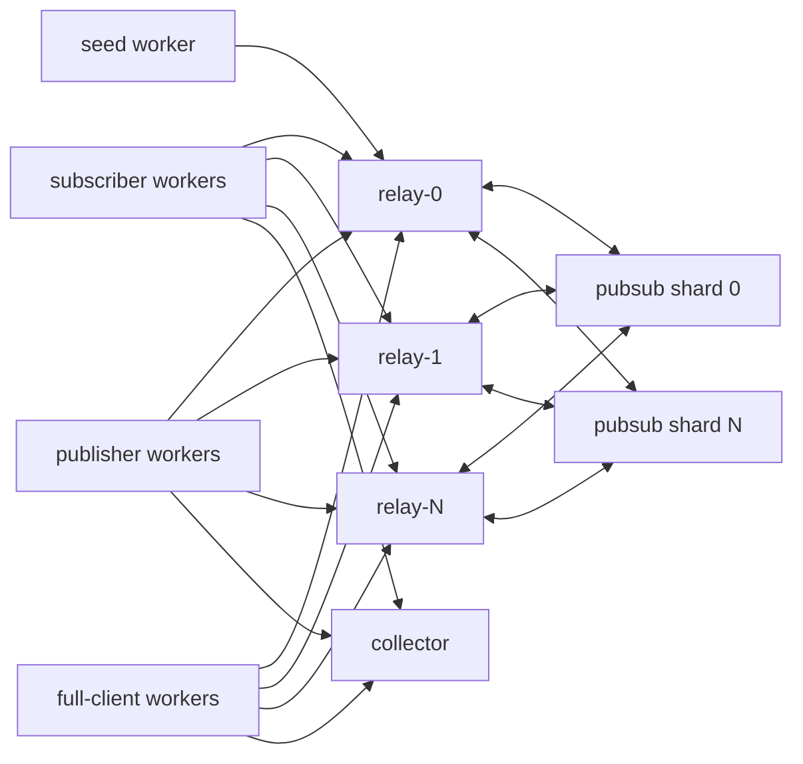

# CGP Loadnet

## SFU authority hard gate

The SFU control-plane gate runs five real CGP relay servers and websocket
clients in Linux Docker. It verifies 3-of-5 certification, a 2-vs-3 pubsub
partition, healing/catch-up, one hard relay death, key substitution rejection,
and bounded old/new authority overlap:

```bash
npm run loadnet:sfu-authority
```

The machine-readable result is written to
`loadnet/results/sfu-authority-hard-gate.json`.

CGP Loadnet is a small Warnet-style harness for realistic relay testing. It starts multiple relay nodes, one or more websocket pubsub hubs, subscriber workers, publisher workers, and an optional Linux `tc netem` latency/loss profile inside Docker.

The purpose is to measure distributed behavior that the in-process `load:relay` benchmark cannot show:

- cross-relay pubsub fanout
- p50/p95/p99 publish acknowledgement latency
- subscriber delivery under network latency and packet loss
- channel partitioning behavior
- socket churn and reconnect pressure
- reconnect recovery through `GET_HISTORY afterSeq` backfill
- relay restart recovery, retained pubsub log replay, and client multi-relay failover
- pubsub hub restart recovery through disk-retained log envelopes and publish ACK/retry
- slow-consumer/backpressure behavior
- full-client behavior: invite links, invite accepts, parties, game sessions/actions, call signaling, relay-routed voice fallback hints, and media attachment provider routing
- relay storage pressure, readiness watermarks, hard write limits, and Docker log caps so stress runs fail before filling the host disk

## Generate A Compose Network

```powershell
npm run loadnet:run -- --profile smoke
npm run loadnet:run -- --profile smoke-binary-v1
npm run loadnet:run -- --profile smoke-sharded-binary-v1
npm run loadnet:run -- --profile smoke-sharded-binary-v2
npm run loadnet:run -- --profile full-clients-smoke
```

Or run the steps manually:

```powershell
npm run loadnet:compose -- --profile smoke
docker build --pull=false -t cgp-loadnet:local -f loadnet/Dockerfile .
docker compose -f loadnet/docker-compose.generated.yml up -d
$collector = docker compose -f loadnet/docker-compose.generated.yml ps -q collector
docker wait $collector
docker compose -f loadnet/docker-compose.generated.yml logs collector
npm run loadnet:verify
docker compose -f loadnet/docker-compose.generated.yml down
```

Results are written into `loadnet/results/summary-*.json`.

Compose generation clears `loadnet/run-data` by default so stale readiness or metrics files cannot contaminate a run. Pass `--keep-data` only when intentionally inspecting an old run directory.

Compose generation now sizes the default Docker subnet from the number of generated services. Million-user full-client profiles produce hundreds of containers, so the default expands beyond `/24`; pass `--subnet` only when you need to avoid a local network collision.

Compose services use capped Docker `json-file` logs by default (`LOADNET_LOG_MAX_SIZE`, `LOADNET_LOG_MAX_FILE`) because noisy million-user failures can otherwise consume more disk than the relay stores themselves.

## Call Verification Smoke

Hollow call signaling has a focused relay/loadnet smoke that runs in-process with two relay nodes and shared pubsub. It publishes the same `CALL_EVENT` envelope the app emits for DM calls, guild voice rooms, guest invite joins, and reconnect history backfill.

```powershell
npm run loadnet:call-verification
```

## RTP Audio Smoke

The RTP audio smoke starts a Docker sender and receiver on a loadnet bridge, applies `tc netem`, sends deterministic PCM16 audio in RTP packets over UDP, and verifies that the receiver reconstructs the exact sample hash and expected tone frequency.

```powershell
npm run loadnet:rtp-audio
npm run loadnet:rtp-audio -- --skip-build
```

The default run sends 800ms of 997Hz PCM16 at 48kHz in 20ms RTP frames with 35ms latency and 10ms jitter. It is intentionally small enough for local iteration and is meant to prove audio payload correctness; browser WebRTC/Opus decode remains a separate browser E2E concern.

## WebSocket Call Media

This loadnet starts one pubsub hub, two relays, a publisher, and one Docker process per observer. Every observer independently verifies the CGP signature and hashes every received media payload. This avoids treating several simulated clients sharing one Node event loop as network latency.

Use `exact` mode for lossless integrity and saturation runs:

```powershell
npm run loadnet:websocket-call-media -- --delivery-mode exact --netem-scope clients --media-profile mixed --messages 10000 --observers 8 --concurrency 64 --latency-ms 80 --jitter-ms 20 --loss-percent 0 --max-publish-p99-ms 1000 --max-observed-p99-ms 2000
```

Use `realtime` mode for deadline-based voice or degraded video. It does not wait for per-frame ACKs, drops backpressured publishes, rejects expired media at relays and clients, and gates both fresh-delivery ratio and p99:

```powershell
npm run loadnet:websocket-call-media -- --delivery-mode realtime --netem-scope clients --media-profile audio --messages 1000 --observers 4 --rate-per-second 47 --media-deadline-ms 500 --min-fresh-delivery-ratio 0.90 --latency-ms 90 --jitter-ms 25 --loss-percent 2 --max-observed-p99-ms 500
npm run loadnet:websocket-call-media -- --delivery-mode realtime --netem-scope clients --media-profile camera --messages 1000 --observers 4 --rate-per-second 47 --media-deadline-ms 1200 --min-fresh-delivery-ratio 0.90 --latency-ms 90 --jitter-ms 25 --loss-percent 2 --max-observed-p99-ms 1200
```

`--netem-scope clients` impairs publisher and observer edges while keeping relay/pubsub interconnects clean. `--netem-scope all` is the harsher infrastructure-chaos profile. Available media profiles are `audio`, `camera`, `screen`, `mixed`, and `stress`. Failed worker metrics remain in `loadnet/results/websocket-call-media-failure-*.json`.

Measured locally on 2026-07-28:

- Realtime audio at 47 frames/s, 90ms/25ms jitter and 2% client-edge loss delivered 3,836/4,000 frames before the 500ms deadline, with 455ms observed p99 and zero corruption.
- Realtime camera plus audio at the production cadence and 4KB camera target delivered 3,772/4,000 frames before deadline, with 1,187ms observed p99 and zero corruption.
- The 10,000-frame mixed exact burst with eight isolated observers, 80ms/20ms client-edge netem, and no loss verified 80,000/80,000 deliveries (7.62MB source payload), with 922ms publish p99 and 925ms observed p99.

The former 22-231 second figures were invalid as network p99 measurements: capture timestamps were assigned before the entire plan was generated, and all observer signature verification shared one event loop. TCP head-of-line blocking under loss is still real, so WebRTC/SFU remains the primary audio/video path. WebSocket media is deadline-bound emergency audio and low-rate preview video, never the large-room media plane.

## WebTransport Call Media

The WebTransport loadnet uses the same deterministic corpus, independent observers, signature checks, payload hashes, and `tc netem` profiles as the WebSocket test. MTU-sized audio/game events use QUIC datagrams. Larger camera and screen frames use one deadline-bound unidirectional QUIC stream per frame, so loss recovery for one frame cannot head-of-line block another stream.

```powershell
npm run loadnet:webtransport-call-media -- --messages 240 --observers 2 --rate-per-second 80 --media-profile audio --latency-ms 45 --jitter-ms 15 --loss-percent 2 --media-deadline-ms 500 --min-fresh-delivery-ratio 0.90
npm run loadnet:webtransport-call-media -- --messages 240 --observers 2 --rate-per-second 40 --media-profile mixed --latency-ms 35 --jitter-ms 10 --loss-percent 1 --media-deadline-ms 1000 --relay-failure-at-ms 1500
```

The transport keeps two relay sessions and publishes the same signed transient frame over the best two paths. Receivers deduplicate by signed event/message identity. `HELLO` and `SUB_TRANSIENT` are idempotently retried because control delivery cannot inherit datagram loss semantics. `--relay-failure-at-ms` hard-stops `relay-0` after publishing begins; `--relay-recovery-after-ms` optionally starts it again.

Measured locally on 2026-07-28:

- The 240-frame audio run under 45ms/15ms jitter and 2% client-edge loss verified 472/480 deliveries before a 500ms deadline, with 85ms observed p99 and zero corruption.
- A 160-frame mixed run under the same delay and 2% loss verified 320/320 observer deliveries, including all camera and screen streams, with 347ms observed p99 and zero corruption.
- A 240-frame mixed run under 35ms/10ms jitter and 1% loss hard-stopped the active relay 1.5 seconds into publication. It verified 480/480 deliveries through the surviving relay, dropped no publishes, and measured 190ms observed p99.

The WebTransport image uses Debian Trixie because the current native QUIC addon requires GLIBC 2.38 or newer. Browser production deployments use native `WebTransport` and do not carry that Node addon.

## Relay Topology Smoke

The relay topology smoke models the intended user-hosted relay design: most users receive media through their assigned self-hosted relay, while NAT-closed users are assigned across a smaller pool of open proxy relays. The worker publishes deterministic transient call-media payloads to per-relay voice channels, verifies byte hashes at the receiving relay, and asserts that open proxy relay load matches the NAT-closed recipient share rather than total user count.

```powershell
npm run loadnet:relay-topology
npm run loadnet:relay-topology -- --skip-build --users 64 --messages 512 --user-relays 8 --open-relays 2 --nat-closed-percent 25
```

The default run uses 64 logical users, 8 user relays, 2 open proxy relays, 25% NAT-closed users, and 512 media messages with 35ms latency and 10ms jitter. A passing run means `observedOpenProxyMessages === expectedOpenProxyMessages`, per-relay message counts match the deterministic route plan, and all media hashes verify.

## Resilient Realtime Topology Lab

The topology lab keeps experimental room placement and forwarding policy outside Hollow's application stores. It runs seven interchangeable paths: TURN mesh, one SFU, direct SFU federation, bounded SFU cascade, global game host, spatial game shards, and a failure-aware shared audio/video/game session.

The resilient path exercises actual process failure rather than a packet-drop approximation:

- weighted rendezvous placement with ordered relay candidates
- the smallest active room cohort that retains configured headroom after relay loss
- direct federation for small demand sets and fanout-four trees for larger sets
- deterministic route epochs that move only clients whose primary failed
- bounded publisher-edge and inter-SFU recovery protection with relay-side deduplication
- abrupt `SIGKILL` of SFU containers and client-sink containers
- stale-epoch queue fencing, departed-client suppression, exact RTP payload checks, and latency SLOs
- one multiplexed route plan carrying selected audio, selected video, and spatial game traffic

Fast 1,000-user release profile:

```powershell
npm run loadnet:topology-lab -- --resilience-only --users 1000 --relays 8 `
  --relay-participant-capacity 200 --target-relay-utilization 0.85 `
  --audio-sources 32 --video-sources 16 --game-sources 16 `
  --audio-top-k 8 --video-tiles 4 --client-sinks 16 --sink-socket-shards 8 `
  --chaos-relays 2 --chaos-client-sinks 2 --resilience-frames 6 `
  --latency-ms 40 --jitter-ms 10 --loss-percent 1 --min-delivery-ratio 0.95 `
  --max-recovery-ms 1000 --max-recovered-p95-ms 300
```

`tc netem` uses an explicit large queue limit so the configured loss is measured without its undocumented default 1,000-packet cap becoming an extra impairment. Each multiplexed sink uses independent UDP socket shards, matching the receive-buffer isolation of separate clients without requiring 1,000 Docker processes.

The relay-count sweep establishes a capacity knee, not a "more is always faster" rule. Client fanout is fixed by subscriptions, while inter-SFU copies grow with active room relays. Extra compatible relays therefore stay warm or host other rooms. The cohort selector requires `targetUtilization * worstCaseSurvivorCapacity >= participants`; failover placement rejects an epoch when the surviving candidate relays cannot satisfy declared capacity.

The lab forwarder is not a production SFU and a passing result is not a global SOTA proof. Reusable control and fast-path policy is under `loadnet/topology/`; `topology-lab-node.ts` is disposable Docker infrastructure. See `docs/realtime-resilience.md` for the evidence, research basis, and remaining production integration gate.

## Profiles

Profiles live in `loadnet/profiles`.

```powershell
npm run loadnet:run -- --profile 1k
```

Manual equivalent:

```powershell
npm run loadnet:compose -- --profile 1k
docker build --pull=false -t cgp-loadnet:local -f loadnet/Dockerfile .
docker compose -f loadnet/docker-compose.generated.yml up -d
$collector = docker compose -f loadnet/docker-compose.generated.yml ps -q collector
docker wait $collector
docker compose -f loadnet/docker-compose.generated.yml logs collector
npm run loadnet:verify
docker compose -f loadnet/docker-compose.generated.yml down
```

Only the pubsub shard services declare the shared `cgp-loadnet:local` image build. The relay, seed, publisher, subscriber, full-client, and collector services reuse that image to avoid concurrent same-tag Docker builds.

Use `docker build --pull=false ...` when iterating locally so Docker does not block on a registry metadata check for an already cached base image.

## Production Confidence Soaks

Use these profiles for multi-hour, production-confidence validation. They are longer than the baseline `smoke`, `1k`, `churn`, `restart`, `pubsub-restart`, and `slow-consumers` profiles and are intended for release candidates, not default CI.

| Profile | Duration | What it stresses |
| --- | --- | --- |
| `soak-long` | 2h | Sustained subscriber churn on a lossy higher-latency link while publishers complete a meaningful early burst. |
| `soak-chaos` | 3h | The same WAN-like churn plus forced relay restarts, forced pubsub restarts, explicit relay network partitions, and delayed consumers. |
| `smoke-sharded-binary-v1` | 30s | Fast validation for binary-v1 with topic-hashed pubsub shards. |
| `smoke-sharded-binary-v2` | 30s | Fast validation for the compact client publish hot path plus topic-hashed pubsub shards. |
| `restart-pubsub-partition-fast` | 3m | Fast chaos regression profile for local iteration: restart + pubsub restart + partitions + slow consumers. |
| `restart-pubsub-partition` | 25m | Faster failure-recovery profile that combines relay restart, pubsub restart, and timed relay partition windows in one run. |
| `full-clients-smoke` | 30s | Local full-client smoke covering invite links, party joins/presence, game app objects, call signaling, media attachment routing, relay storage watermarks, and user-hosted relay fallback hints. |
| `full-clients-helia-media-smoke` | 30s | Small two-relay smoke that uploads real media bytes through `cgp.media.storage`, pins them in embedded Helia, then fetch-verifies the CID from another networked Helia relay. |
| `100k-distributed` | 1h | Distributed stress shape for 100k subscribers with churn/restarts/partitions to tune fanout and replay behavior. |
| `1m-distributed` | 2h | Extreme profile template for 1M subscribers; intended for cluster-scale environments only. |
| `1m-full-clients` | 5m | Local million-user full-client stress: 1M logical users, 1M full-client events, invite/party/game/call/fallback/media surfaces, relay storage gates, 6k live subscribers, churn, slow consumers, and WAN loss. |
| `1m-full-clients-cluster` | 2h | Extreme cluster template: 1M logical users, 2M full-client events, 200k live subscribers, media-provider policy, hosted relay hints, restarts, partitions, and WAN loss. This profile is not sized for Docker Desktop. |

Run one with:

```powershell
npm run loadnet:run -- --profile soak-long
npm run loadnet:run -- --profile soak-chaos
npm run loadnet:run -- --profile restart-pubsub-partition-fast
npm run loadnet:run -- --profile restart-pubsub-partition
npm run loadnet:run -- --profile full-clients-smoke
npm run loadnet:run -- --profile full-clients-helia-media-smoke
npm run loadnet:run -- --profile 1m-full-clients
npm run loadnet:run -- --profile soak-chaos --compact-after-run
```

Verify the resulting summary with strict delivery and head-consistency gates:

```powershell
npx tsx loadnet/verify-summary.ts --summary loadnet/results/summary-<id>.json --min-delivery-ratio=1.0 --max-publisher-p99-ms=30000 --max-relay-head-lag=0
npx tsx loadnet/verify-summary.ts --summary loadnet/results/summary-<id>.json --min-full-client-verification-ratio=1.0 --max-full-client-p99-ms=30000
```

Pass criteria:

- `collectorComplete` is `true`
- `metrics.length` matches `expectedMetrics`
- published messages match the profile
- subscriber delivery ratio is exactly `1.0`
- duplicate replay delivery stays within the configured `--max-duplicate-ratio` gate (chaos defaults to `0.02`, baseline defaults to `0.0`)
- publisher batch `p99` stays within the configured `--max-publisher-p99-ms` gate (defaults: `30000ms` baseline, `60000ms` chaos)
- relay-head `invalidCount`, `errorCount`, and `conflictCount` are all `0`
- relay-head `validCount` is greater than `0`
- every required `netem` target reports `applied: true`
- full-client profiles publish exactly the configured event count, verify those events through live observers and/or history backfill, and require invite, party, game, call, relay-fallback, and configured media surfaces to be exercised
- relay storage summaries are present, hard storage limits are not breached, and relay readiness exposes soft-limit pressure through `/readyz`

## Network Emulation

Each service gets these profile controls:

- `wireFormat` (`json`, `binary-json`, `binary-v1`, or `binary-v2`; applies to relay/client/pubsub websocket paths)
- `pubSubShards` (number of topic-hashed pubsub hubs; relays subscribe/publish each channel topic to its shard)
- `latencyMs`
- `jitterMs`
- `lossPercent`
- `churnEveryMs`
- `relayRestartEveryMs`
- `relayRestartCount`
- `pubSubRestartEveryMs`
- `pubSubRestartCount`
- `partitionEveryMs`
- `partitionDurationMs`
- `partitionCount`
- `partitionRelaySpan`
- `slowConsumerPercent`
- `slowConsumerDelayMs`
- `voiceChannels`, `partyChannels`, `gameChannels`
- `fullClientWorkers`
- `fullClientsPerWorker` (logical users represented by each worker)
- `fullClientActiveSigners` (bounded signing key pool used by logical users)
- `fullClientActionsPerWorker`
- `fullClientBatchSize`
- `fullClientObserverSockets`
- `fullClientParties`
- `fullClientGameRooms`
- `fullClientCallRooms`
- `fullClientInviteLinks`
- `fullClientFallbackRelayPercent`
- `userHostedRelays`
- `fullClientFinalBackfill`
- `fullClientBackfillPageLimit`
- `fullClientMediaEvery` (0 disables synthetic media attachments; positive values inject routed media refs at that cadence)
- `fullClientMediaBytes`
- `fullClientMediaTags`
- `relayStorageSoftLimitBytes`
- `relayStorageHardLimitBytes`
- `relayStorageEstimateIntervalMs`

Containers need `NET_ADMIN` so `tc qdisc replace dev eth0 root netem ...` can apply latency/loss. If Docker cannot grant it, the harness still runs and logs a netem warning.

## Architecture


```mermaid
flowchart LR
  PubSub0["pubsub shard 0"]
  PubSubN["pubsub shard N"]
  Seed["seed worker"]
  Collector["collector"]
  Relay0["relay-0"]
  Relay1["relay-1"]
  RelayN["relay-N"]
  Sub["subscriber workers"]
  Pub["publisher workers"]
  Full["full-client workers"]

  Relay0 <--> PubSub0
  Relay0 <--> PubSubN
  Relay1 <--> PubSub0
  Relay1 <--> PubSubN
  RelayN <--> PubSub0
  RelayN <--> PubSubN
  Seed --> Relay0
  Sub --> Relay0
  Sub --> Relay1
  Sub --> RelayN
  Pub --> Relay0
  Pub --> Relay1
  Pub --> RelayN
  Full --> Relay0
  Full --> Relay1
  Full --> RelayN
  Sub --> Collector
  Pub --> Collector
  Full --> Collector
```

The seed worker creates one public guild and N channels, then writes `/data/scenario.json` to the shared volume. Small profiles bootstrap every relay directly; larger profiles bootstrap through the primary relay by default and rely on pubsub/peer catch-up to distribute the initial log. Override with `LOADNET_BOOTSTRAP_RELAY_COUNT` when you need direct bootstrap fanout. Subscriber workers subscribe to channel partitions and write readiness files. Subscriber reconnects rotate across every configured relay so restart tests measure cluster recovery instead of a single pinned socket. Publisher workers wait for readiness, publish through all configured relays, and write metrics. Other relays receive and persist the sequenced log through pubsub replication before serving backfill. Loadnet disables independent checkpoint timers because follower-created checkpoints would intentionally fork the log; production checkpointing should be sequencer-owned or otherwise consensus-coordinated. The collector aggregates metrics and verifies signed relay heads.

Full-client workers are multiplexed logical clients. They keep actual socket counts bounded while publishing signed CGP events as many logical users: invite link creation and acceptance via `org.hollow.invites`, party membership and presence via `org.hollow.parties`, game session/actions via `org.hollow.games`, `CALL_EVENT` signaling for joins, offers, ICE, media-state, and relay-routed fallback, plus optional `MESSAGE.attachments[]` that reference routed media objects. The seed scenario also includes synthetic user-hosted relay operator hints so call fallback can be tested without pretending that media bytes are flowing through WebRTC in the harness. Each worker verifies its own full-client events through live observer sockets and final `GET_HISTORY` backfill before writing metrics.

Loadnet media events do not upload blob bytes into LevelDB. The default large profiles model the production contract: clients ask `/plugins/cgp.media.storage/route` or `/upload-intent`, upload to a chosen provider, then publish an attachment locator with provider metadata. Profiles with `fullClientMediaUpload=true` go further and POST real bytes to `/plugins/cgp.media.storage/upload`; the relay pins through a registered CGP IPFS backend such as embedded Helia, and `fullClientMediaFetchVerify=true` fetches the CID from another relay to prove networked peer retrieval. Generated compose profiles include topic-specific IPFS-style providers for memes, anime/art, dog/photo media, a general fallback, an opt-in adult host, and HTTPS-origin fallback. The important scale signal is whether the relay policy rejects mismatched content classes and whether the event log stores bounded metadata rather than media payloads.

Large profiles throttle initial WebSocket establishment so Docker DNS, relay accept queues, and the host API do not turn startup into a single all-at-once connection storm. Publishers and full-client workers also use a bounded relay window instead of dialing every relay in the cluster. Tune with `LOADNET_CLIENT_RELAY_WINDOW`, `LOADNET_SUBSCRIBER_CONNECT_CONCURRENCY`, `LOADNET_SUBSCRIBER_CONNECT_TIMEOUT_MS`, `LOADNET_SUBSCRIBER_CONNECT_RETRY_MS`, `LOADNET_FULL_CLIENT_OBSERVER_CONNECT_CONCURRENCY`, `LOADNET_FULL_CLIENT_OBSERVER_CONNECT_TIMEOUT_MS`, and `LOADNET_FULL_CLIENT_OBSERVER_CONNECT_RETRY_MS`.

Profiles with `churnEveryMs > 0` enable subscriber backfill on reconnect. Each subscriber tracks the newest event sequence it saw and sends `GET_HISTORY` with `afterSeq` after reconnecting. Churn profiles also perform a final stable history sweep before writing metrics, which separates temporary live-frame loss from durable recovery failures.

Relay restart profiles also verify follower recovery from retained pubsub log envelopes. On startup, a relay scans its durable guild heads, subscribes to each guild log topic with `afterSeq`, and replays retained envelopes from the pubsub hub. Signed relay-head gossip triggers the same catch-up path when another relay proves a newer canonical head exists.

Pubsub restart profiles verify that the hub can come back with its retention journal intact. Relays keep unacknowledged pubsub publishes and resend them after reconnect; pubsub ACKs are only sent once the hub accepts a publish into its retention path.

Relay containers also expose `/healthz`, `/readyz`, and `/metrics` on the relay HTTP port. These endpoints are deliberately low-cardinality and safe for load balancer probes or scrape-based dashboards during large runs. `/readyz` flips to `not_ready` after `CGP_RELAY_STORAGE_SOFT_LIMIT_BYTES`; writes are rejected with `RELAY_STORAGE_FULL` after `CGP_RELAY_STORAGE_HARD_LIMIT_BYTES`. The collector records every relay's storage estimate in the summary so a run can fail on disk pressure rather than by exhausting Docker Desktop storage. When `pubSubShards` is greater than one, relays use topic hashing so channel fanout is partitioned across pubsub hubs while every shard keeps its own retained replay journal under `/data/pubsub-retain/shard-N`.

For disaster recovery beyond retained pubsub windows, operators can run `npm run ops:relay -- sync-from-relay --db <db> --guild <guild> --relay <ws://peer>`. The command requests large contiguous `GET_LOG_RANGE` pages, verifies sequence/hash/signature continuity locally, and appends only canonical missing events. When multiple peers are available, use `npm run ops:relay -- repair-from-quorum --db <db> --guild <guild> --relays <ws://a,ws://b>` so the operator path first verifies signed relay-head quorum and then syncs from a matching canonical source.

After multi-hour retention or replay tests, operators can reclaim LevelDB space with `npm run ops:relay -- compact-db --db <db> --verify`. The compaction path runs against the backing store and can optionally verify every guild log afterward. `npm run loadnet:run -- --compact-after-run` executes that compaction/verification inside every relay container before teardown, so long soak runs can exercise backup, restore, repair, and compaction workflows instead of only live delivery.

## Current Baseline

Validated on April 20, 2026:

| Profile | Result |
| --- | --- |
| `smoke` | 3 relays, 100 subscribers, 200 messages, 25ms latency/5ms jitter. Delivered 5,000/5,000 expected subscriber events. Every relay persisted seq 204 with 50 messages per channel. |
| `1k` | 4 relays, 1,000 subscribers, 2,000 messages, 40ms latency/10ms jitter/0.05% loss. Delivered 250,000/250,000 expected subscriber events. Every relay persisted seq 2008 with 250 messages per channel. |
| `churn` | 4 relays, 600 subscribers, 1,600 messages, 35ms latency/10ms jitter/0.02% loss/~1,370 reconnects. Delivered 120,000/120,000 expected subscriber events. Every relay persisted seq 1608 with 200 messages per channel. |
| `restart` | 4 relays, 200 subscribers, 2,000 messages, 45ms latency/15ms jitter/0.05% loss, churn, two forced relay restarts during active publishing. Delivered 50,000/50,000 expected subscriber events. Every relay persisted seq 2008 with 250 messages per channel. |
| `pubsub-restart` | 4 relays, 200 subscribers, 1,600 messages, 45ms latency/15ms jitter/0.05% loss, churn, two forced pubsub hub restarts during active publishing. Delivered 40,000/40,000 expected subscriber events. Every relay persisted seq 1608 with 200 messages per channel. |
| `slow-consumers` | 4 relays, 800 subscribers, 2,000 messages, 35ms latency/10ms jitter/0.02% loss, 10% delayed consumers. Delivered 200,000/200,000 expected subscriber events. Every relay persisted seq 2008 with 250 messages per channel. |

If live delivery succeeds but final backfill fails, inspect follower relay stores first. Durable replication depends on the `guild:<guildId>:log` pubsub topic; channel topics are only the optimized live-fanout path.
